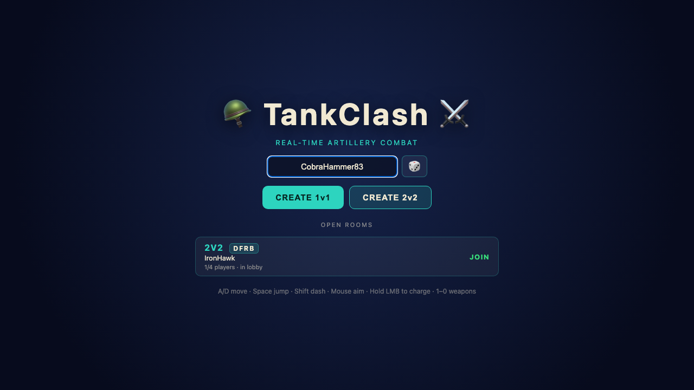
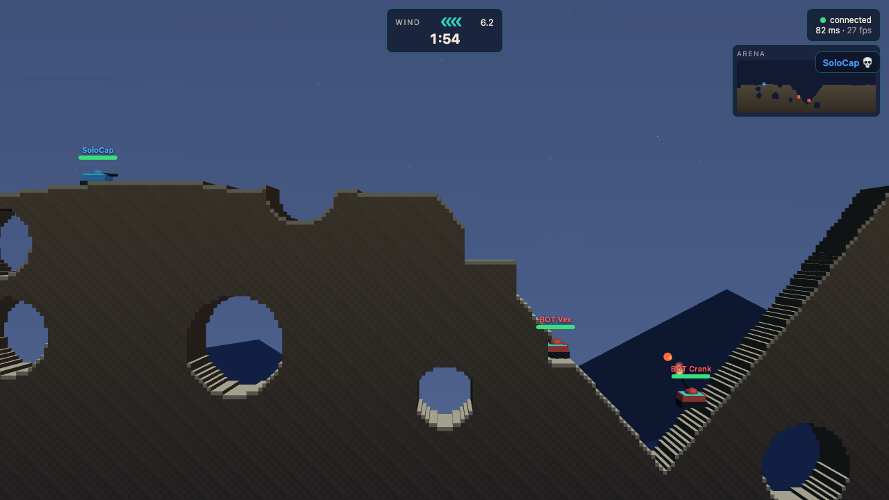

# 🪖 TankClash ⚔️

Real-time multiplayer artillery combat on destructible terrain. Two armored
vehicles duel on a procedurally generated arena, aiming continuously, charging
physics-based cannon shots, reshaping the battlefield with craters, and fighting
the wind — a 2.5D side-view slice rendered with Three.js over an authoritative
Colyseus server.

It spans Milestone 3: a lobby with **1v1 / 2v2 / spectator** modes, **ten
weapons**, **four arena layouts**, a minimap, real craters and tunnels, wind,
knockback, status effects (shield/burn), round summaries, win/loss, round
restart, and auto-reconnect.




Full documentation lives in [`docs/`](docs/README.md): [getting
started](docs/getting-started.md), [architecture](docs/architecture.md),
[networking](docs/networking.md), [gameplay & tuning](docs/gameplay.md), and
[verification](docs/verification.md).

## Requirements

- Node.js 22+

## Install

```bash
npm install
# for the screenshot verification gate only:
npx playwright install chromium
```

## Run (local development)

Start the server and client together:

```bash
npm run dev
```

- Server (Colyseus) → `http://localhost:2567`
- Client (Vite) → `http://localhost:8080`

Open `http://localhost:8080` in a browser. The first screen is a **room
browser**: create a 1v1 / 2v2 room or join an open one. Inside the room, bots
fill any empty slots, so a match is always playable; open a second browser tab
and join the same room to play against another human.

Run the pieces separately if you prefer:

```bash
npm run dev:server   # tsx watch on :2567
npm run dev:client   # vite on :8080
```

### Production build

```bash
npm run build        # client → public/  (deployed to GitHub Pages)
npm run build:server # server → dist/server/index.js
npm start            # run the built server
```

Point the client at a remote server by setting `SERVER_URL` at build time
(see `.env.example`):

```bash
SERVER_URL="game.example.com:2567" npm run build
```

## Controls

| Key | Action |
| --- | --- |
| `A` / `D` | move left / right |
| `Space` | jump |
| `Shift` | dash |
| Mouse | aim |
| Left mouse | hold to charge, release to fire |
| `1`–`9`, `0` | select weapon |
| `Tab` | scoreboard |
| `Enter` | restart (on the win screen) |
| `Esc` | pause menu (resume / leave match → spectate; spectators leave the room) |

A **gamepad** also works (standard mapping): left stick / d-pad move, A jump,
B dash, right trigger charge/fire, right stick aim, LB/RB cycle weapons, Start
restart. Keyboard/mouse and pad can be used interchangeably.

The teal arc previews where your shot lands, accounting for the selected
weapon, charge, and wind.

## Weapons

| # | Weapon | Role |
| --- | --- | --- |
| 1 | Cannon | balanced charge arc — the all-rounder |
| 2 | Mortar | heavy high-arc lobber; big crater, drops behind cover |
| 3 | Shotgun Shell | 6-pellet spread; brutal up close, scatters at range |
| 4 | Cluster Rocket | flat rocket that bursts into bomblets — area denial |
| 5 | Drill Missile | tunnels through terrain, then detonates — defeats cover |
| 6 | Railgun | hyper-velocity flat shot; near-instant, big direct hit |
| 7 | Gravity Bomb | implodes — pulls victims inward toward hazards |
| 8 | Napalm | low burst, strong burn damage-over-time |
| 9 | Shield Grenade | team support: shields allies in the burst |
| 0 | Repair Foam | team support: heals allies in the burst |

Each weapon has its own projectile/explosion color, cooldown, and terrain
interaction. Arenas rotate each round between four layouts: rolling **hills**,
a **plateau** with a central chasm, hollow **caverns**, and **islands** over
deep gaps. Shield and burn are status effects (shield reduces incoming damage;
burn ticks damage over time).

## Rooms, teams & ready-up

The first screen lists open rooms. **Create** a 1v1 or 2v2 room, or click an
existing one to **join** (rooms already in battle are joined as a spectator).

Inside a room's lobby you can:

- switch **team** (blue / red) or drop to **spectate**;
- toggle **ready**;
- **leave** back to the browser.

Bots fill every empty fighter slot, and a joining human **replaces a bot**. The
first human in a room is the **host** — only the host can **start**. On start,
the match begins after a **3 s** countdown if everyone is ready, or **10 s**
otherwise. You can't leave while the countdown runs.

Leaving mid-match (the pause menu's "Leave Match", or `Esc`) **kills your tank
and turns you into a spectator**; from spectator, `Esc` opens a menu to leave the
room. When a match ends the room returns to the lobby for a re-ready. A solo/bot
match can still be frozen with `Esc` (pause).

A direct link with `?autostart` (optionally `?mode=2v2`) skips the browser,
creates a room, and starts immediately — used by the screenshot gate.

## Verification

Four objective gates guard every change (see `PROGRESS.md` for the iteration log):

```bash
npm run typecheck   # tsc, zero errors
npm test            # vitest: physics, terrain, damage, weapons, status, match, lobby, prediction, gamepad (61 tests)
npm run match:sim   # headless bot-vs-bot match: completes, no NaN, tick budget
npm run screenshot  # Playwright: boots server+client, captures a live match
```

## Architecture

```
shared/   constants, math (seeded RNG/noise), terrain grid, vehicle physics, weapons, types
server/   GameSim (authoritative) + systems, Colyseus room, bot AI, schema
client/   Three.js rendering, input, prediction, net, HUD
scripts/  matchSim + screenshot verification gates
tests/    vitest unit + reconciliation tests
```

- **`shared/`** holds everything that must be identical on both sides. The
  terrain is a **destructible 2D solidity grid** (not a heightmap — tunnels and
  overhangs are required) generated deterministically from a seed, so the client
  reconstructs the exact arena from the seed plus replayed crater events.
  `shared/physics.ts` exposes `stepVehicle` behind a `VehicleBody` interface so
  the very same movement code runs server-side and in the client predictor.

- **`server/GameSim`** is the authoritative simulation, written free of any
  networking concern. The Colyseus room drives it on a fixed timestep; the
  headless match-sim harness drives the identical class without a socket in
  sight. Systems are split by concern: `physicsSystem`, `weaponSystem`,
  `damageSystem`, `terrainSystem`, `windSystem`, `matchSystem`.

- **`client/`** renders interpolated state. The destructible terrain is drawn as
  chunked merged meshes that rebuild lazily where craters land. Bots
  (`server/bots/BotController`) produce the exact same `PlayerInput` a human
  client sends, so they obey identical rules.

## Networking

- **Server-authoritative.** Match state, positions, health, projectiles, damage,
  terrain destruction, cooldowns, and win/loss are all decided server-side.
- **Fixed timestep 30 Hz** simulation; **20 Hz** state patches to clients.
- **Snapshot interpolation** renders remote entities at `now − 100 ms`, lerping
  between the two surrounding snapshots for smooth motion under jitter.
- **Client-side prediction + reconciliation** for the local tank: input is
  applied immediately for zero-latency feel, then unacknowledged inputs are
  replayed against each authoritative patch (keyed on a synchronized input
  sequence number). Large divergence (respawn) hard-snaps. This is a clean
  foundation for rollback without committing to it yet.
- **Terrain destruction** is synchronized as compact crater events
  (center + radius), not full-grid sync — the client carves its local grid to
  match.

## Gameplay tuning

Key constants live in `shared/constants.ts` and `shared/weapons.ts`:

- Vehicles accelerate to `MAX_SPEED` 18 u/s with friction and a `STEP_UP` slope
  climb of 1.5 u — responsive but heavy. Jump, dash (2 s cooldown), recoil, and
  blast knockback all feed the same velocity.
- The cannon charges over 1.4 s (muzzle speed 30→85), carves a 4.5 u crater,
  deals 34 splash + 14 direct-hit bonus with distance falloff, and self-damage is
  scaled to 0.6.
- Wind drifts gradually toward a target resampled every 8–15 s, capped at
  ±10 u/s² of horizontal acceleration on projectiles — tactical, never random
  spikes.
- Rounds run 120 s, then **sudden death** decays health so matches always
  resolve (the headless harness relies on this to stay finite).

## Known limitations

- Milestone 3 is complete: ten weapons, 1v1 / 2v2 / spectator, lobby, round
  summary, gamepad support. (Replay recording was removed from the spec.)
- Gamepad mapping is unit-tested but live controller testing needs a physical
  pad; the keyboard/mouse path is what the screenshot gate exercises.
- Prediction covers movement only; projectiles are server-spawned and shown via
  events, not locally predicted.
- No rollback yet — the netcode is structured for it but does not implement it.
- Drilling can leave visually floating terrain chunks (the solidity grid has no
  connectivity/collapse pass); physics stays consistent since collision reads
  the same grid.
- There is no world floor: falling through a fully-destroyed column is lethal (a
  danger zone). Bots don't yet path around freshly-opened pits, so they can
  occasionally fall in.
- Bot aiming uses a closed-form ballistic solver (now weapon-aware via
  `gravityScale`) with light wind compensation; it is competent, not expert.
- Headless screenshot FPS (~45) is measured under software WebGL (SwiftShader);
  real GPUs render the slice far faster.
